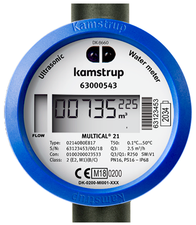

# esp-multical21
ESP8266/ESP32 decrypts wireless MBus frames from a Multical21 water meter.


A CC1101 868 MHz module is connected via SPI to the ESP8266/ESP32.
The Multical21 is transmitting encrypted MBus frames (Mode C1, frame type B) every 16 seconds.
The ESP8266/ESP32 does some validation (right serial number, crc checking) and then
decrypts them with AES-128-CTR.

The serial number (8 digits) is printed on the water meter (above the LCD).
Ask your water supplier for the decryption key (16 bytes). I got mine packed in a so called
KEM-file. To extract the key i used a python script [kem-decryptor.py](https://gist.github.com/mbursa/caa654a01b9e804ad44d1f00208a2490)


The Multical21 provides the following meter values:
<ul>
<li> total counter - total water consumption in m³
<li> target counter - water consumption till 1. day of the current month
<li> medium temperature - in °C
<li> ambient temperature - in °C
<li> info codes - BURST, LEAK, DRY, REVERSE, TAMPER, RADIO OFF
</ul>

The ESP8266/ESP32 prints out the current meter values via UART (baudrate: 115200). 
The UART output looks something like this:
```
total: 1636.265 m³ - target: 1624.252 m³ - 13 °C - 22 °C - 0x00
```
Additionally the values are sent via MQTT to a given broker.

Rename [config_template.h](include/config_template.h) to _**config.h**_ and fill in some information.

Provide your water meter serial number and decryption key.

```
// ask your water supplier for your personal encryption key 
#define ENCRYPTION_KEY      0x00, 0x11, 0x22, 0x33, 0x44, 0x55, 0x66, 0x77, 0x88, 0x99, 0xAA, 0xBB, 0xCC, 0xDD, 0xEE, 0xFF
// serial number is printed on your multical21
#define SERIAL_NUMBER       0x63, 0x00, 0x05, 0x43
```

Add your Wifi credentials (ssid, password). Add your MQTT broker ip address. If your
broker uses authentication add MQTT username/password. 

```
// more than one wifi credentials are supported, upper one wins
// "ssid", "wifi_passphrase", "mqtt_broker", "mqtt_username", "mqtt_password"
std::vector<CREDENTIAL> const credentials = {
     { "ssid1", "********", "", "", ""}   // no MQTT
   , { "ssid2", "********", "10.14.0.1", "", ""} // MQTT without auth
   , { "ssid3", "********", "10.0.0.111", "mqttuser", "mqtt1234"}  // MQTT with auth
};
```

Change the MQTT prefix and the topic names as you like. Currently the water counter value
is published in **watermeter/0/total**
```
#define MQTT_PREFIX "watermeter/0" 
#define MQTT_total "/total"
#define MQTT_target "/target"
#define MQTT_ftemp "/flowtemp"
#define MQTT_atemp "/ambienttemp"
#define MQTT_info "/infocode"
```


Connect your ESP8266/ESP32 to the CC1101 868Mhz module:
| CC1101 | ESP8266 | ESP32 |
|--------|:-------:|:-----:|
| VCC    | 3V3     | 3V3 |
| GND    | GND     | GND |
| CSN    | D8     | 4 |
| MOSI   | D7     | 23 |
| MISO   | D6     | 19 |
| SCK    | D5     | 18 |
| GD0    | D2      | 32 |
| GD2    | not connected| not connected|

Thanks to [weetmuts](https://github.com/weetmuts) for his great job on the wmbusmeters.
